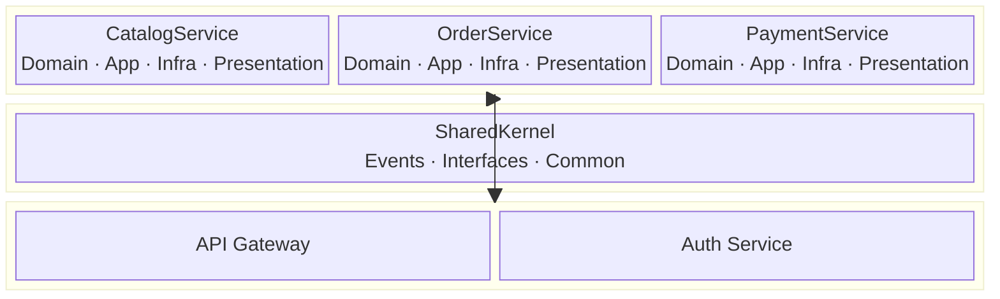

# ZMA Large Template

**ZMA (Zohaib Modular Architecture) — Large Tier**

A full microservices architecture with Catalog, Order, and Payment services plus API Gateway and SharedKernel.

## What's Included

- **Services**: CatalogService, OrderService, PaymentService — each with their own Domain, Application, Infrastructure, Presentation
- **SharedKernel**: Domain Events, IRepository interface, Result pattern
- **Gateways**: API Gateway, Auth Service
- Domain-Driven Design concepts (Aggregates, Value Objects, Domain Events)
- Event-driven communication patterns

## Usage

```shell
# Install the template
dotnet new install ZMA.Large.Template

# Scaffold a project
dotnet new zma-large -n MyApp

# Build all services
cd MyApp
dotnet build
```

## Architecture



## Learn More

- GitHub: https://github.com/zohaib-khan-786/ZK-Hybrid-Architecture
- CLI Tool: `dotnet tool install -g ZMA.Tool` then run `zma`
