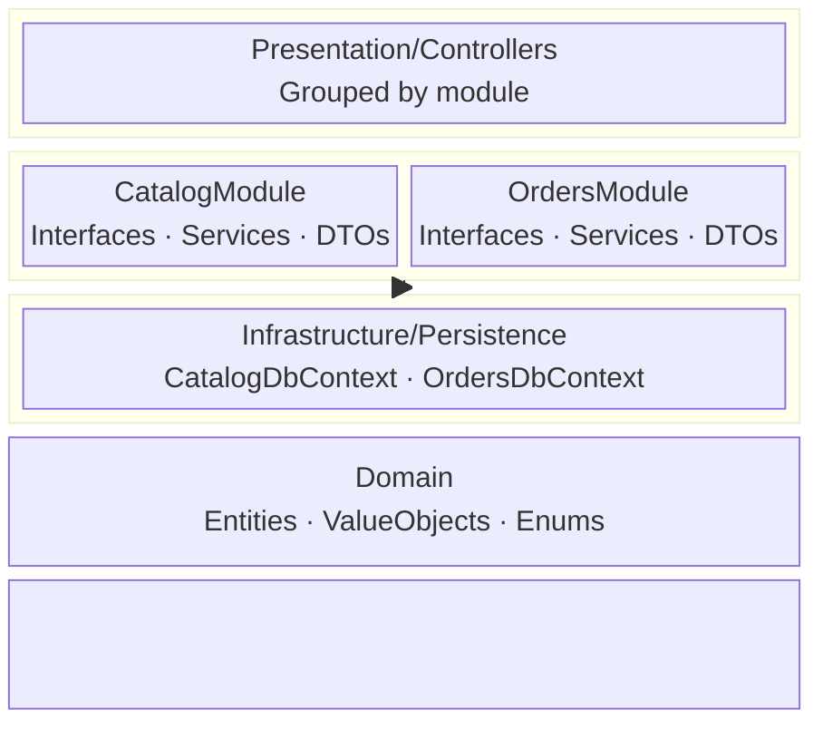

# ZMA Medium Template

**ZMA (Zohaib Modular Architecture) — Medium Tier**

A modular monolith with module-per-feature separation using separate DbContexts.

## What's Included

- **Domain**: Entities, Value Objects, Enums
- **Application**: CatalogModule + OrdersModule with their own Interfaces, Services, DTOs
- **Infrastructure**: Separate CatalogDbContext and OrdersDbContext, Repositories per module
- **Presentation**: ASP.NET Core Web API controllers grouped by module
- Module isolation while still in a single deployable unit
- Ready to split into microservices when you scale

## Usage

```shell
# Install the template
dotnet new install ZMA.Medium.Template

# Scaffold a project
dotnet new zma-med -n MyApp

# Run it
cd MyApp
dotnet run --project MyApp.Presentation
```

## Architecture



## Learn More

- GitHub: https://github.com/zohaib-khan-786/ZK-Hybrid-Architecture
- CLI Tool: `dotnet tool install -g ZMA.Tool` then run `zma`
