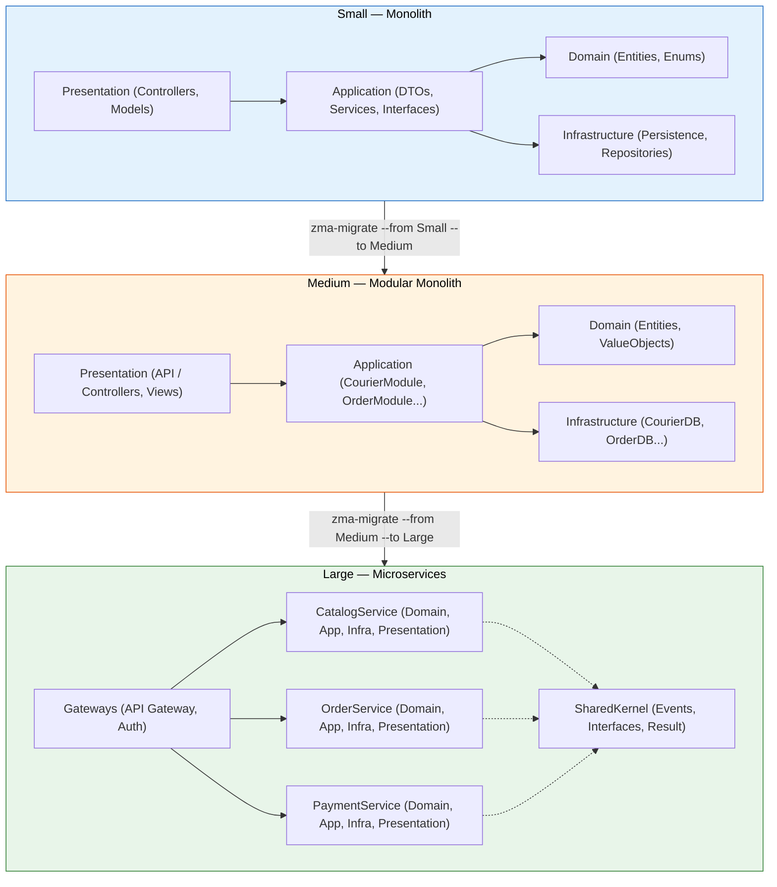
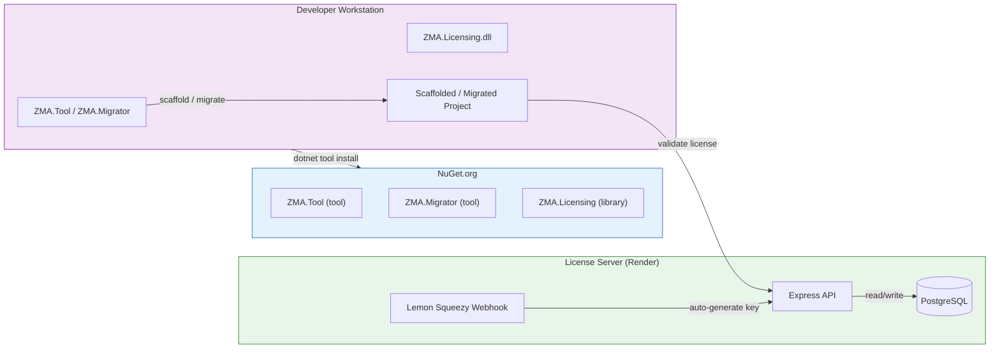
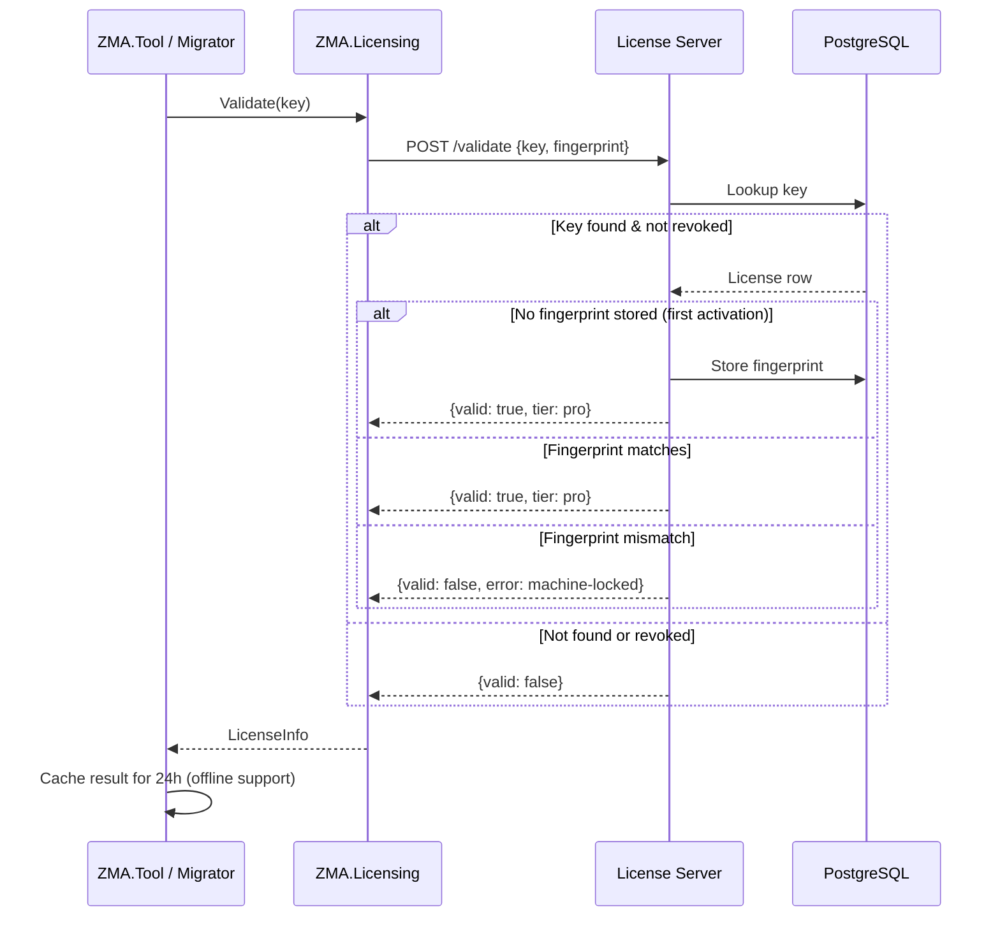

# 🏗️ ZK Hybrid Architecture (ZHA)

**Created by:** Zohaib Khan  
**Purpose:** A complete toolkit for building modular .NET applications that scale from small monoliths to full microservices — without rewriting.

---

## 📖 Overview

ZK Hybrid Architecture is a **modular, scalable, beginner-friendly** architecture pattern combining **Clean Architecture**, **Microservices principles**, and **Domain-Driven Design (DDD)** into a single practical solution — backed by a full toolchain.

### What You Get

| Component | Description |
|-----------|-------------|
| **ZMA.Tool** | CLI scaffolder — creates Small, Medium, or Large tier projects in seconds |
| **ZMA.Migrator** | CLI migrator — automatically migrates your project between tiers |
| **ZMA.Licensing** | NuGet library — license validation + machine-locking (used internally) |
| **License Server** | Node.js/PostgreSQL API — key generation, validation, revocation, webhooks |
| **Templates** | 3 pre-built `dotnet new` templates (Small, Medium, Large) |

---

## 🎯 Quick Start

```shell
# 1. Install the scaffolder
dotnet tool install -g ZMA.Tool

# 2. Scaffold a project
zma

# 3. Run it
cd MyApp
dotnet run --project MyApp.Presentation
```

> Scaffolds in **interactive** mode (prompts for tier, project type, name) or **non-interactive**:
> ```shell
> zma --tier Small --name MyApp --project-type mvc --non-interactive
> ```

---

## 🧩 The Three Tiers



### Small Tier
- Flat folder structure — all entities in shared layers
- Single `AppDbContext` with InMemory database
- Ideal for prototypes, MVPs, beginners

### Medium Tier
- Entities split into **per-module** folders (e.g., `CourierModule/`, `OrderModule/`)
- Each module gets its own `DbContext`, DTOs, Interfaces, Services
- Cross-module `using` directives auto-detected and injected
- Perfect for growing applications that need modularity without microservice overhead

### Large Tier
- Each entity becomes a **standalone microservice** with its own `.sln`
- `SharedKernel` (Events, Interfaces, Result) shared across services
- API Gateway + Auth Service for routing and auth
- Full event-driven communication via integration events

---

## 💻 Tools & Commands

### ZMA.Tool (`zma`)

Scaffolds a new project from scratch.

| Flag | Alias | Description |
|------|-------|-------------|
| `--tier` | `-t` | Small, Medium, or Large |
| `--project-type` | `-p` | `webapi` (default) or `mvc` |
| `--name` | `-n` | Project name |
| `--output` | `-o` | Output directory |
| `--non-interactive` | | Skip prompts (use with flags above) |
| `--register` | | Register a Pro license key |
| `--version` | | Show current version + license status |

```shell
# Interactive (prompts for everything)
zma

# Non-interactive example
zma -t Small -n MyApp -p mvc -o ./projects --non-interactive

# Check license status
zma --version
```

### ZMA.Migrator (`zma-migrate`)

Migrates an existing project between tiers. **Fully generic** — no hardcoded entity names.

```shell
# Upgrade from Small to Medium
zma-migrate --from Small --to Medium --source ./MyApp

# Upgrade from Medium to Large
zma-migrate --from Medium --to Large --source ./MyApp
```

The migrator:
- Scans `Domain/Entities/` for entity classes
- Classifies every file (DTOs, Interfaces, Services, Controllers, etc.)
- Moves files into per-module folders (Medium) or per-service projects (Large)
- Rewrites namespaces, `using` directives, and `Program.cs`
- Handles cross-module references automatically
- Preserves MVC controllers and `.cshtml` views
- Splits `AppDbContext` into per-module `DbContexts`

### ZMA.Licensing (`ZMA.Licensing`)

NuGet library for license validation. Used internally by ZMA.Tool and ZMA.Migrator.

```shell
dotnet add package ZMA.Licensing
```

```csharp
var validator = new LicenseValidator();
var info = validator.Validate("ZMA-XXXX-XXXX-XXXX");
Console.WriteLine(info.IsRegistered ? "Licensed" : "Free edition");
```

---

## 🔄 Project Type: Web API vs MVC

When scaffolding, choose your project type:

| Type | Description |
|------|-------------|
| `webapi` (default) | Controllers inherit `ControllerBase`, no views |
| `mvc` | Controllers inherit `Controller`, `Views/` with `HomeController`, `_Layout.cshtml`, Bootstrap |

The migrator **auto-detects** MVC from source controllers (checks for `: Controller` vs `: ControllerBase`) and generates the appropriate `Program.cs` (`AddControllers()` vs `AddControllersWithViews()` + `MapControllerRoute()`).

---

## 📦 NuGet Packages

| Package | Latest | Install |
|---------|--------|---------|
| **ZMA.Tool** | 1.0.8 | `dotnet tool install -g ZMA.Tool` |
| **ZMA.Migrator** | 1.0.9 | `dotnet tool install -g ZMA.Migrator` |
| **ZMA.Licensing** | 1.0.2 | `dotnet add package ZMA.Licensing` |

Update all tools:
```shell
dotnet tool update -g ZMA.Tool
dotnet tool update -g ZMA.Migrator
```

---

## ☁️ License Server

The license server is a **Node.js/Express + PostgreSQL** API deployed on Render:

```
https://zk-hybrid-architecture.onrender.com
```

**Endpoints:**

| Method | Path | Auth | Description |
|--------|------|------|-------------|
| `POST` | `/api/license/generate` | `Bearer ADMIN_TOKEN` | Create a new license key |
| `POST` | `/api/license/validate` | Public | Validate a key + machine fingerprint |
| `POST` | `/api/license/revoke` | `Bearer ADMIN_TOKEN` | Revoke a license key |
| `POST` | `/api/license/webhook/lemonsqueezy` | Webhook secret | Auto-deliver keys via Lemon Squeezy |
| `GET` | `/health` | Public | Health check (includes DB status) |

### One-click Deploy

[](https://render.com/deploy?repo=https://github.com/zohaib-khan-786/ZK-Hybrid-Architecture)

The `render.yaml` at the repo root configures everything — a free PostgreSQL database + the Node.js service. You only need to set `ADMIN_TOKEN`.

---

## 💳 Licensing & Purchase

### Free Edition
- **Max 2 entities** per project
- Files watermarked with a comment header
- No expiration

### Pro Edition — $29 Lifetime
- **Up to 99 entities**
- No watermarks
- Machine-locked to your workstation (first activation binds the key)

### How to Buy

1. Send **$29** via:
   - **Payoneer**: `killerzobi893@gmail.com`
   - **Nayapay**: `03481809798 — Zohaib Khan`
2. Email `killerzobi893@gmail.com` with your full name
3. I'll reply with your **Pro license key**

Or run after purchase:
```shell
zma --register --key ZMA-XXXX-XXXX-XXXX
```

---

## 🗺️ Ecosystem Architecture



---

## 🧪 License Validation Flow



---

## 🧱 Repository Structure

```
ZMA.Tool/              # CLI scaffolder (C#)
ZMA.Migrator/          # CLI migrator (C#)
ZMA.Licensing/         # License client library (C#)
license-server/        # License server API (Node.js/Express)
ZMA.Small.Template/    # dotnet new template — Small tier
Medium/                # dotnet new template — Medium tier
Large/                 # dotnet new template — Large tier
docs/                  # Architecture diagrams
render.yaml            # Render blueprint
```

---

## 💡 Architecture Philosophy

> *"Start small, scale smart, never rewrite."*

ZK Hybrid Architecture is built on three principles:

1. **Progressive complexity** — Start with a simple monolith (Small). When it grows, migrate to modular (Medium). When you need true microservices, scale up (Large). No rewrites.

2. **Generic tooling** — The migrator has zero hardcoded entity names. It scans your `Domain/Entities/`, analyzes your code, and restructures everything automatically.

3. **Offline-first licensing** — License validation caches results for 24h. Work offline, validate when connected. No constant phone-home.

---

## 📜 License

MIT License — You are free to use, modify, and distribute.  
*The license server, validation logic, and CLI tools are open-source; security comes from server-side enforcement, not hidden code.*

---

## 🤝 Contributing

Fork, branch, PR — all welcome. Report issues at [github.com/zohaib-khan-786/ZK-Hybrid-Architecture/issues](https://github.com/zohaib-khan-786/ZK-Hybrid-Architecture/issues).
