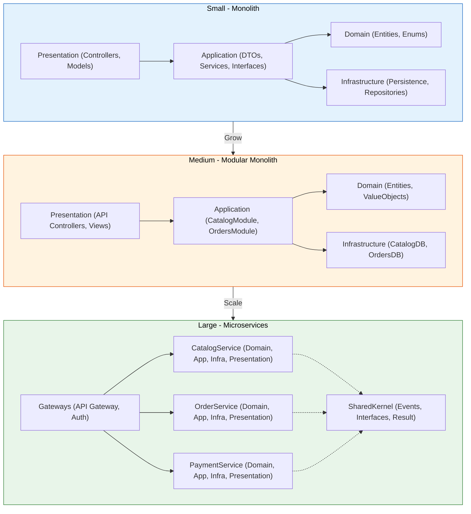

# 🏗️ ZK Hybrid Architecture (ZHA)

**Created by:** Zohaib Khan  
**Purpose:** To simplify the journey from beginner to enterprise-level development by combining the strengths of multiple architectural styles.

---

## 📖 Overview

ZK Hybrid Architecture is a **modular, scalable, and beginner-friendly** architecture pattern that blends the **Clean Architecture**, **Microservices principles**, and **Domain-Driven Design (DDD)** into a single, practical solution.  

It is designed for:
- Beginners who struggle with complex architectures.
- Intermediate developers looking for scalability.
- Teams building applications that can grow from **small monoliths** into **full microservices** without rewriting everything.

---

## 🚀 Why ZK Hybrid Architecture?

Most developers face these problems:
- **Steep learning curve** of Clean Architecture and DDD.
- Difficulty scaling from small to large projects.
- Lack of standardization between services and shared modules.
- Hard to implement **cross-cutting concerns** like logging, authentication, and event communication.

**ZK Hybrid Architecture solves these by:**
- Starting with a monolith-friendly modular setup.
- Gradually splitting modules into microservices as the app grows.
- Providing a **Shared Kernel** for common contracts and utilities.
- Enforcing a **clear folder structure** for easy navigation.

---

## 📂 Folder Structure

Services/
├── CatalogService/
│ ├── Domain/
│ ├── Application/
│ ├── Infrastructure/
│ └── Presentation/
├── OrderService/
│ ├── Domain/
│ ├── Application/
│ ├── Infrastructure/
│ └── Presentation/
└── PaymentService/
├── Domain/
├── Application/
├── Infrastructure/
└── Presentation/

SharedKernel/
├── Events/
│ └── IntegrationEvent.cs
├── Interfaces/
│ └── IRepository.cs
├── Common/
│ └── Result.cs

Gateways/
├── API Gateway/
└── Auth Service/

---

## 🔑 Core Components

### **1. Services/**
Each business module follows **Clean Architecture layers**:
- **Domain** → Entities, Value Objects, Domain Events, Aggregates
- **Application** → Use Cases, Service Interfaces, DTOs
- **Infrastructure** → Data Access, External Services, Implementations
- **Presentation** → API Controllers, View Models, Endpoints

### **2. SharedKernel/**
Contains shared contracts and utilities:
- **Events/** → Integration events for inter-service communication.
- **Interfaces/** → Shared contracts like `IRepository`.
- **Common/** → Utility classes like `Result<T>`.

### **3. Gateways/**
- **API Gateway** → Single entry point for clients.
- **Auth Service** → Central authentication and authorization.

---

## 📈 Scaling Process



### **Phase 1 – Small Application**
- All services live in a **single repository**.
- Communication between modules is **in-process**.

### **Phase 2 – Growing Application**
- Individual modules can be **deployed independently**.
- SharedKernel remains in a **NuGet package** or shared library.

### **Phase 3 – Large Enterprise**
- Services become fully **independent microservices**.
- Communication happens via **message brokers** (RabbitMQ, Kafka) or API calls.
- API Gateway handles routing, caching, and rate limiting.

---

## 💡 Use Cases
- E-commerce platforms.
- ERP & CRM systems.
- SaaS applications.
- Event-driven applications.

---

## 📜 Why I Created ZHA
> "As a developer, I noticed beginners often get lost in complex architectures like DDD or Hexagonal.  
I created **ZK Hybrid Architecture** to bridge the gap — a clean, scalable, and understandable approach  
that grows with your project without forcing you to rewrite everything later."  
— **Zohaib Khan**

---

## 🛠 Getting Started

### 1️⃣ Clone the Repo
```
git clone https://github.com/zohaib-khan-786/ZK-Hybrid-Architecture.git
cd ZK-Hybrid-Architecture
```

### 2️⃣ Install a Template
```
dotnet new install ZMA.Small.Template
dotnet new zma-small -n MyApp
cd MyApp
dotnet run
```

### 3️⃣ Restore & Build
```
dotnet restore
dotnet build
```

---

## 📜 License
MIT License — You are free to use, modify, and distribute.

---

## 🌟 Contributing
Contributions are welcome! Fork the repository, create a feature branch, and submit a pull request.
