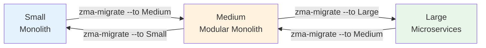

# ZMA Migrator

**Migrate ZMA projects between Small, Medium, and Large tiers without rewriting code.**

## Install

```shell
dotnet tool install -g ZMA.Migrator
```

## Usage

```shell
zma-migrate --from Medium --to Large --project ./MyApp
```

## Arguments

| Flag | Alias | Description |
|------|-------|-------------|
| `--from` | `-f` | Source tier: Small, Medium, or Large |
| `--to` | `-t` | Target tier: Small, Medium, or Large |
| `--project` | `-p` | Path to the project root |
| `--non-interactive` | `--auto` | Skip confirmation prompts |

## What it does



- Restructures folders and namespaces to match the target tier
- Splits/merges DbContexts and modules
- Updates project references and solution files
- Preserves all existing business logic, entities, and configuration

## Entity Limits

| Tier | Max Entities | 
|------|-------------|
| Free | 2 |
| Pro  | 99 |

Free tier handles up to 2 entities. Purchase a Pro license at [zma.dev](https://zma.dev).

## Learn More

- GitHub: https://github.com/zohaib-khan-786/ZK-Hybrid-Architecture
