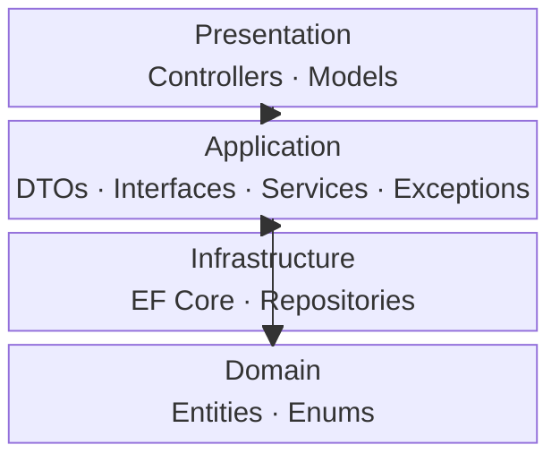

# ZMA Small Template

**ZMA (Zohaib Modular Architecture) — Small Tier**

A monolith Clean Architecture scaffold with 4 layers: Domain, Application, Infrastructure, Presentation.

## What's Included

- **Domain**: Entities (Product, Order), Enums (OrderStatus, UserRole)
- **Application**: DTOs (Create/Update), Service Interfaces & Implementations, Custom Exceptions
- **Infrastructure**: EF Core DbContext, Repositories (ProductRepository, OrderRepository)
- **Presentation**: ASP.NET Core Web API controllers (ProductController, OrderController)
- Pre-configured DI wiring with `UseInMemoryDatabase`
- Full CRUD endpoints for Product and Order

## Usage

```shell
# Install the template
dotnet new install ZMA.Small.Template

# Scaffold a project
dotnet new zma-small -n MyApp

# Run it
cd MyApp
dotnet run --project MyApp.Presentation
```

## Architecture



## Learn More

- GitHub: https://github.com/zohaib-khan-786/ZK-Hybrid-Architecture
- CLI Tool: `dotnet tool install -g ZMA.Tool` then run `zma`
