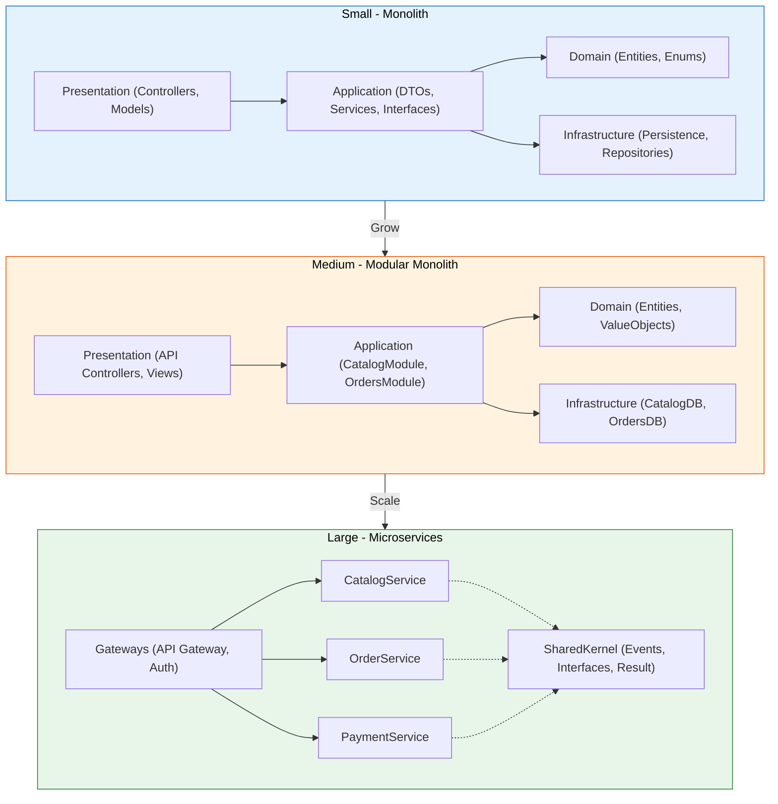

ZMA – Zohaib Modular Architecture
ZMA (Zohaib Modular Architecture) is a scalable, modular approach to building applications that lets you start small and grow without painful rewrites.

The core idea:

Build once, scale forever.
Start with a small, clean structure. As your app grows to medium or full scale — or even to microservices — you keep the same foundation.

This architecture is perfect for teams who:

Start with a monolith but plan to scale later.

Want clear boundaries between features.

Prefer code organization that evolves with the product.

---

## 1️. Small-Scale Structure
Ideal for prototypes, MVPs, or small internal tools.
Everything is simple, but still separated into layers for maintainability.

bash
Copy
Edit
Application/
 ├── DTOs/            # ProductDto, OrderDto
 ├── Interfaces/      # IProductService, IOrderService
 ├── Services/        # ProductService, OrderService
 ├── Exceptions/      # Custom exceptions
 └── Validators/      # CreateProductValidator

Domain/
 ├── Entities/        # Product, Order, Role
 └── Enums/           # OrderStatus, UserRole

Infrastructure/
 ├── Persistence/     # DbContext, Migrations
 ├── Repositories/    # ProductRepository, OrderRepository
 └── ExternalServices/# PaymentGateway, EmailSender

Presentation/
 ├── Controllers/     # ProductController, OrderController
 └── Models/          # ViewModels
2️. Medium-Scale Structure
When the project grows, modules are introduced in the Application and Infrastructure layers to keep features isolated.

Domain/
 ├── Entities/
 ├── ValueObjects/
 └── Enums/

Application/
 ├── CatalogModule/
 │   ├── Interfaces/
 │   ├── Services/
 │   └── DTOs/
 ├── OrdersModule/
 │   ├── Interfaces/
 │   ├── Services/
 │   └── DTOs/
 └── Shared/
     ├── Validators/
     └── Exceptions/

Infrastructure/
 ├── Persistence/     # Separate schema per module
 ├── Repositories/
 └── ExternalServices/

Presentation/
 ├── API/
 │   └── Controllers/ # Grouped by module
 ├── Views/
 └── Models/
3️. Full-Scale / Microservices Structure
Each feature becomes its own independent service, still following the same ZMA layer structure.

Services/
 ├── CatalogService/
 │   ├── Domain/
 │   ├── Application/
 │   ├── Infrastructure/
 │   └── Presentation/
 ├── OrderService/
 │   ├── Domain/
 │   ├── Application/
 │   ├── Infrastructure/
 │   └── Presentation/
 └── PaymentService/
     ├── Domain/
     ├── Application/
     ├── Infrastructure/
     └── Presentation/

SharedKernel/
 ├── Events/
 ├── Interfaces/
 └── Common/

Gateways/
 ├── API Gateway/     # Unified entry point
 └── Auth Service/    # Central authentication
Why ZMA Works
Zero rewrite scaling – the structure simply expands.

Clear module boundaries – easier to maintain, test, and deploy.

Microservice-ready – design services like microservices from day one.

ZMA blends the familiarity of Clean Architecture with the flexibility of modular monoliths, making it an excellent choice for long-term projects.

