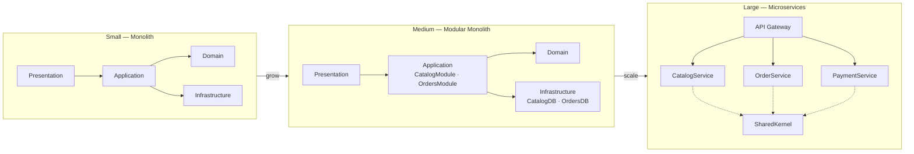

# ZMA Tool

**ZMA (Zohaib Modular Architecture) — Interactive CLI Scaffolder**

A dotnet global tool that interactively scaffolds ZMA architecture projects.

## Install

```shell
dotnet tool install -g ZMA.Tool
```

## Usage

### Interactive mode (default)

```shell
zma
```

### Non-interactive mode (CI pipelines)

```shell
zma --tier Small --name MyApp --output ./projects --non-interactive
```

### Check version / license status

```shell
zma --version
```

### Register a license key

```shell
zma --register --key ZMA-XXXX-XXXX-XXXX
```

## Arguments

| Flag | Alias | Description |
|------|-------|-------------|
| `--tier` | `-t` | Architecture tier: Small, Medium, or Large |
| `--name` | `-n` | Project name |
| `--output` | `-o` | Output directory (defaults to current directory) |
| `--non-interactive` | `--auto` | Skip all prompts; requires `--tier` and `--name` |
| `--register` | `-r` | Register a license key |
| `--key` | `-k` | License key (used with `--register`) |
| `--version` | `-v` | Show version and license status |

## Licensing

| Tier | Max Entities | Watermark | Price |
|------|-------------|-----------|-------|
| Free | 2 | Yes | $0 |
| Pro  | 99 | No | Purchase at zma.dev |

The free edition watermarks generated files. Purchase a Pro key at [zma.dev](https://zma.dev) and activate with:

```shell
zma --register --key YOUR-KEY-HERE
```

## What it scaffolds



## Learn More

- GitHub: https://github.com/zohaib-khan-786/ZK-Hybrid-Architecture
