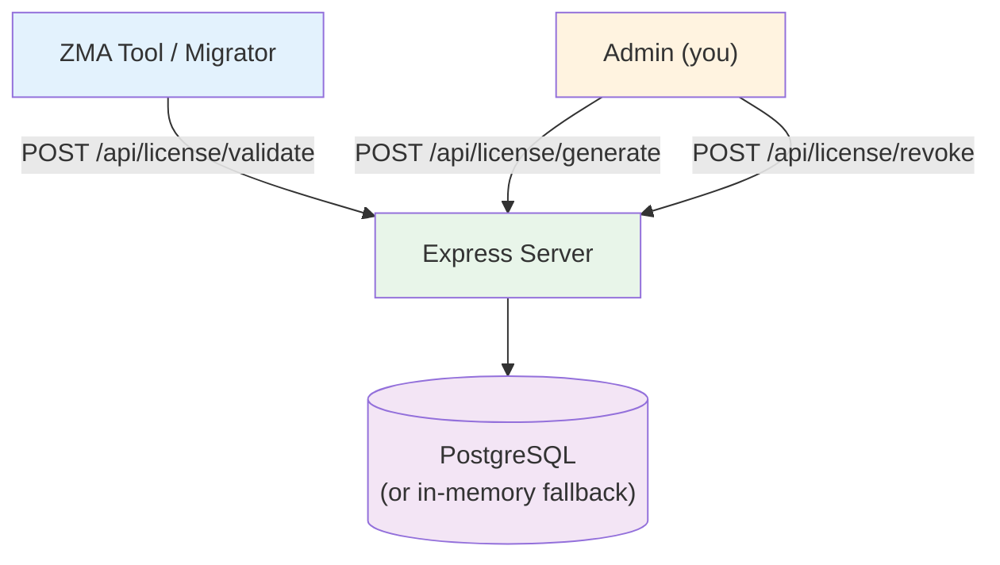

# ZMA License Server

**Node.js + Express + PostgreSQL license validation server for ZMA Toolkit.**

Deployable on Railway (free tier) with zero configuration.

## Architecture



## Endpoints

| Method | Path | Auth | Description |
|--------|------|------|-------------|
| `POST` | `/api/license/generate` | `Admin` | Generate a new license key |
| `POST` | `/api/license/validate` | None | Validate a key + machine-lock |
| `POST` | `/api/license/revoke` | `Admin` | Revoke a license key |

## Deploy to Railway

```shell
# 1. Push the full repo to GitHub
# 2. Connect repo to Railway
# 3. ⚠️ IMPORTANT: Set Root Directory to "license-server"
#    Service → Settings → Root Directory → "license-server"
#    (Otherwise Railway will scan the whole repo and fail)
# 4. Set environment variable:
#    ADMIN_TOKEN = your-secret-admin-token
# 5. Add PostgreSQL plugin
# 6. Deploy
```

## Generate a License

```shell
curl -X POST https://your-app.railway.app/api/license/generate \
  -H "Authorization: Bearer $ADMIN_TOKEN" \
  -H "Content-Type: application/json" \
  -d '{"licensee":"Customer Inc","email":"admin@customer.com"}'
```

## Environment Variables

| Variable | Required | Description |
|----------|----------|-------------|
| `ADMIN_TOKEN` | Yes | Secret token for admin endpoints |
| `DATABASE_URL` | No | PostgreSQL connection string (falls back to in-memory) |

## Learn More

- GitHub: https://github.com/zohaib-khan-786/ZK-Hybrid-Architecture
- Client Library: `ZMA.Licensing` NuGet package
