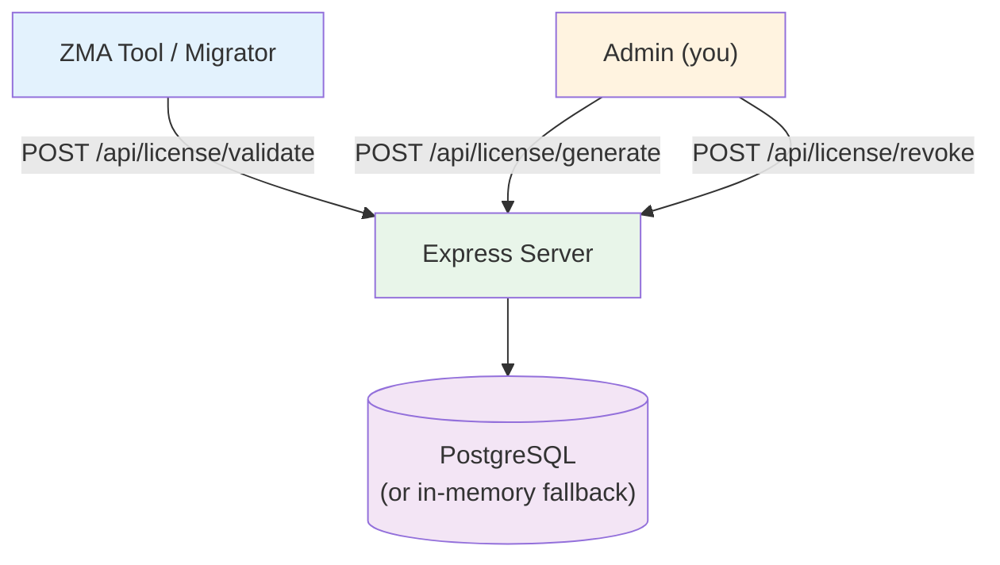

# ZMA License Server

**Node.js + Express + PostgreSQL license validation server for ZMA Toolkit.**

Deployable on Railway (free tier) with zero configuration.

## Architecture



## Endpoints

| Method | Path | Auth | Description |
|--------|------|------|-------------|
| `POST` | `/api/license/generate` | `Admin` | Generate a new license key |
| `POST` | `/api/license/validate` | None | Validate a key + machine-lock |
| `POST` | `/api/license/revoke` | `Admin` | Revoke a license key |

## Deploy to Render (free)

The easiest way is via the **Blueprint** (infrastructure-as-code):

[](https://render.com/deploy?repo=https://github.com/zohaib-khan-786/ZK-Hybrid-Architecture)

Render will prompt you to set `ADMIN_TOKEN` and automatically create a free PostgreSQL database.

### Manual setup

```shell
# 1. Go to https://dashboard.render.com
# 2. New + → Web Service → Connect your GitHub repo
# 3. ⚠️ Set Root Directory → "license-server"
# 4. Build Command: npm install && npm run build
# 5. Start Command: npm start
# 6. Add environment variable:
#    ADMIN_TOKEN = your-secret-admin-token
# 7. New + → PostgreSQL → choose Free plan
# 8. Copy the Internal Connection String into DATABASE_URL
# 9. Deploy
```

## Generate a License

```shell
curl -X POST https://your-app.railway.app/api/license/generate \
  -H "Authorization: Bearer $ADMIN_TOKEN" \
  -H "Content-Type: application/json" \
  -d '{"licensee":"Customer Inc","email":"admin@customer.com"}'
```

## Environment Variables

| Variable | Required | Description |
|----------|----------|-------------|
| `ADMIN_TOKEN` | Yes | Secret token for admin endpoints |
| `DATABASE_URL` | No | PostgreSQL connection string (falls back to in-memory) |
| `LEMON_SQUEEZY_WEBHOOK_SECRET` | No | Webhook signing secret from Lemon Squeezy |

## Selling Licenses (Manual)

For now, handle sales manually via Payoneer:

1. Customer sends payment to your Payoneer email
2. You run this command to generate their key:

```shell
curl -X POST https://zk-hybrid-architecture.onrender.com/api/license/generate \
  -H "Authorization: Bearer YOUR_ADMIN_TOKEN" \
  -H "Content-Type: application/json" \
  -d "{\"licensee\":\"Customer Name\",\"email\":\"customer@email.com\"}"
```

3. Reply with the returned key (e.g. `ZMA-XXXX-XXXX-XXXX`)
4. They activate it: `zma --register --key ZMA-XXXX-XXXX-XXXX`

The webhook endpoint (`/api/license/webhook/lemonsqueezy`) is ready for future automated delivery when you want to add a payment processor.

## Learn More

- GitHub: https://github.com/zohaib-khan-786/ZK-Hybrid-Architecture
- Client Library: `ZMA.Licensing` NuGet package
